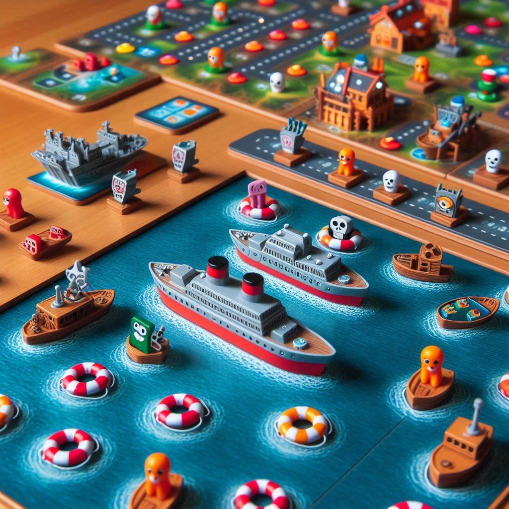

# 🎮 Proyecto1-Juegos-Python

# Desarrollo de Videojuegos Clásicos en Python

Bienvenidos a mi primer proyecto de desarrollo de videojuegos 🎉. 
El objetivo es aplicar y demostrar los conocimientos de programación para construir estos juegos interactivos.

## Descripción del Proyecto

El proyecto consiste en el desarrollo de **cuatro** juegos clásicos en Python, cada uno implementado como una clase individual, que se pueden ejecutar desde un menú principal. Los juegos implementados son:

1. **Piedra, Papel, Tijera**: El tradicional juego de piedra, papel y tijera donde se le dará también la opción de jugar también con lagarto y spock.
2. **Ahorcado**: El clásico juego donde el usuario tiene que adivinar una palabra antes de que se complete el dibujo de la horca.
3. **Preguntados**: Un juego de preguntas en diferentes categorías donde el usuario debe acertar 10 preguntas seguidas para ganar.
4. **Tres en Raya**: Un juego en el que el usuario se enfrenta a la máquina en un tablero 3x3.

Cada juego tiene sus propias reglas y características, las cuales se explican en los archivos correspondientes.

### Funcionalidades Principales

1. **Menú de Selección**:
   - Al ejecutar `main.py`, el usuario verá un menú donde puede seleccionar entre los 4 juegos disponibles o salir.
   
2. **Selección de Juegos**:
   - Cada juego se ejecuta al seleccionar la opción correspondiente en el menú. El archivo de cada juego está en la carpeta `src`.
   
3. **Bienvenida y Reglas**:
   - Cada juego presenta una bienvenida, explica sus reglas y comienza el juego contra la máquina.
   
4. **Opciones al Finalizar**:
   - Una vez finalizado un juego, el usuario puede:
     - Volver a jugar.
     - Volver al menú principal.
     - Salir del salón de juegos.

## 🛠️ Estructura del Proyecto

El proyecto está organizado de la siguiente manera:

- **main.py**: Archivo principal en el cual se encuentra el menú de los juegos y hace llamadas archivos individuales de cada juego dentro de la carpeta src/

- **src/**: Carpeta que contiene los archivos de los juegos, cada uno programado como una clase.
  - `preguntados.py`
  - `tres_en_raya.py`
  - `ahorcado.py`
  - `piedra_papel_tijera.py`
  - `auxiliar.py`

## 🛠️ Instalación y Requisitos
Este proyecto usa Python 3.8 y requiere las siguientes bibliotecas:
- time
- random

Para instalar y ejecutar el proyecto en tu máquina local, sigue estos pasos:

1. **Clona el repositorio**:
   ```bash
   git clone [URL del repositorio]
   
2. **Navega a la carpeta del proyecto**:
   ```bash
   cd Proyecto1-Juegos-Python

2. **Ejecuta el programa**:
   ```bash
   python main.py


### 💡 Ideas Futuras
Algunas ideas para mejorar el proyecto en el futuro:

- Añadir más juegos clásicos al salón.
- Implementar un sistema de puntuación general como usuario del salón de juegos.
- Hacer que los jugadores puedan competir entre sí (multijugador).
- Añadir niveles de dificultad a los juegos.